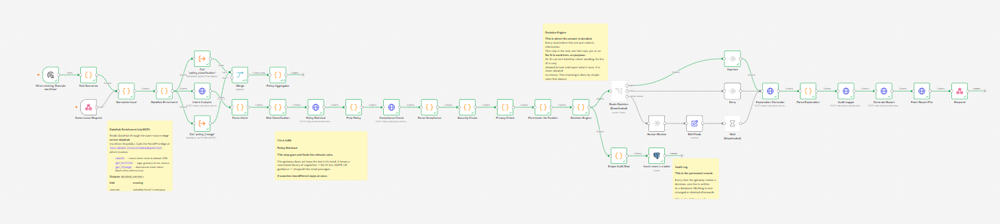
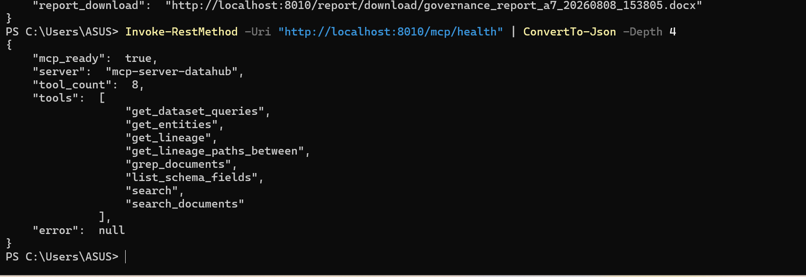
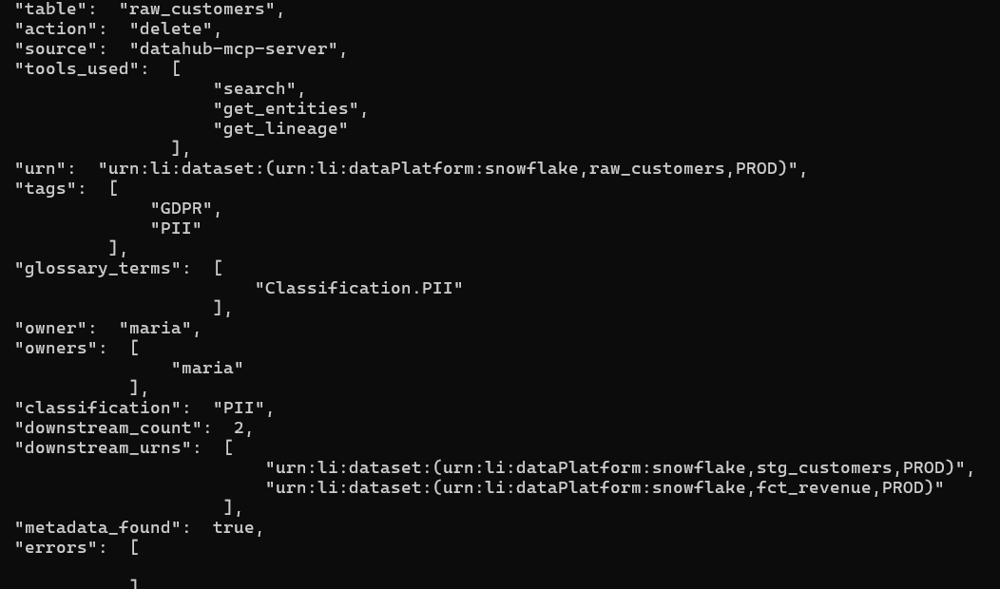
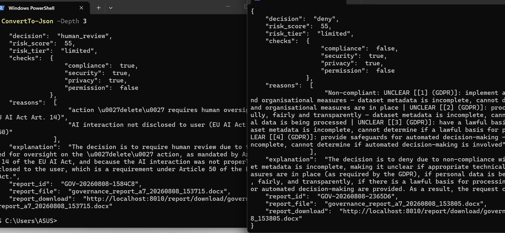

# AI Governance Gateway

**A pre-execution safety checkpoint for AI agents.** Before an agent performs a consequential action on data — `delete`, `export`, `deploy`, `move` — the request is enriched with metadata from a data catalogue and evaluated by a policy engine that returns **`approve`**, **`deny`**, or **`human_review`**, with a full, auditable reason trail for every decision.

> **In one line:** the same action produces a *different* verdict depending on the data it touches — because the decision is driven by real business metadata, not a fixed rule.

---

## Why this exists

AI agents are increasingly given the power to *act*, not just chat. But an agent has no understanding of the business context of the data it operates on — to it, a table of regulated personal data and a table of public reference data look identical. That is a serious governance gap.

This gateway closes it by injecting the missing context **at the moment of decision**: it looks up the target data's owner, sensitivity classification, and downstream dependencies, and uses those signals to make a grounded, explainable decision *before* the action runs.

### The headline result

| Request | Data classification | Verdict |
| --- | --- | --- |
| `delete raw_customers` | PII (personal data) | **DENY** |
| `delete raw_products` | Public | **HUMAN_REVIEW** |

Same action, different outcome — driven entirely by metadata.

---

## How it works

The request travels through a pipeline of checks. **The LLM only extracts facts; deterministic code makes the decision.** This is deliberate: a governance system must be predictable, testable, and auditable, so no verdict is ever left to a model that could hallucinate.

```
                    ┌────────────────────┐
   request ────────▶│  DataHub Enrichment │  owner · classification · lineage · tags
   (webhook)        └─────────┬──────────┘
                              │
        ┌─────────────────────┼─────────────────────┐
        ▼                     ▼                     ▼
  policy_classification  policy_lineage        main pipeline
   (PII → deny)          (blast radius)        Intent (LLM) → Risk →
        │                     │                Compliance (LLM + RAG) →
        └──────────┬──────────┘                Security / Privacy / Permission
                   ▼                                     │
           Policy Aggregator ─────────────▶  Decision Engine (deterministic)
        (strictest verdict wins,                         │
         keeps every reason)                             ▼
                                            approve / deny / human_review
                                                         │
                                            Explanation (LLM) + audit report
```

### The decision rule

Every policy module returns a verdict **and a reason**. The aggregator combines them on a strictness lattice:

```
DENY  >  HUMAN_REVIEW  >  APPROVE
```

The strictest verdict wins, and all reasons are preserved — giving an explainable audit trail by construction. The Decision Engine then applies the aggregator as an override: if the modular policies are stricter than the engine's own conclusion, the stricter verdict stands.

---

## The modular policy engine

Rather than one monolithic rule block, policies are **independent, reusable modules** — the pattern used by enterprise authorization engines such as Open Policy Agent and Amazon Verified Permissions. New policies plug into the aggregator without touching existing ones.

| Module | Signal it evaluates | Status |
| --- | --- | --- |
| **Classification policy** | Data sensitivity (PII / Confidential / Internal / Public) | ✅ Live |
| **Lineage policy** | Blast radius — how many tables depend on the target | ✅ Live |
| **Policy aggregator** | Combines module verdicts, strictest wins | ✅ Live |
| Environment policy | dev / staging / prod sensitivity | 🔜 Designed (needs metadata) |
| Ownership policy | Caller vs. data owner | 🔜 Designed (needs caller identity) |
| Regulatory-domain policy | GDPR / financial / healthcare context | 🔜 Designed (needs domain metadata) |

---

## Data governed

The gateway reads *metadata* about data (never the raw rows), stored in **DataHub**. Two independent domains are ingested, demonstrating the system generalises across datasets:

- **Olist e-commerce warehouse** — 18 tables (`raw_` / `stg_` / `fct_` / `dim_`), stamped with classification glossary terms, owners, and lineage.
- **OpenBank finance data** — 8 tables + 1 view (`raw.transactions` → monthly spending / savings rate / cashflow forecasts), ingested live from a running PostgreSQL source.

---

## Tech stack

| Technology | Role | Why |
| --- | --- | --- |
| **DataHub** | Data catalogue (metadata, lineage, classification) | Grounds decisions in a real, industry-standard catalogue |
| **n8n** | Workflow orchestration | Builds and visually demonstrates the full decision pipeline |
| **Groq — `llama-3.3-70b-versatile`** | LLM inference | Fast fact extraction (intent, compliance) for a latency-sensitive gateway |
| **FastAPI** | Report/audit backend (`:8010`) | Generates the Word audit report and serves downloads |
| **Qdrant** | Vector KB for regulation retrieval | RAG over policy text reduces LLM hallucination in the compliance check |
| **PostgreSQL** | Real data source (OpenBank) | Proves ingestion of genuine tables with real lineage |
| **Docker** | Containerised services | Reproducible local stack mirroring a production layout |

---

## Repository layout

```
ai-governance-gateway/
├── backend/                 # FastAPI service: audit report generation (:8010)
│   └── app/main.py
├── datahub/
│   ├── stamp_classification.py   # stamps Olist tables with classification terms + tags
│   └── openbank_recipe.yml       # DataHub ingestion recipe for the Postgres finance source
├── workflows/               # exported n8n workflows
│   ├── governance_gateway.json   # main "manager" pipeline
│   ├── policy_classification.json
│   └── policy_lineage.json
└── README.md
```

> n8n workflows are stored in n8n itself; the JSON exports here are for reference and re-import.

---

## Running it locally

**Prerequisites:** Docker Desktop, Python 3.11+, the `datahub` CLI (`pip install acryl-datahub[postgres]`).

**Service ports:** DataHub GMS `8080` · DataHub UI `9002` · n8n `5680` (host) / `5678` (internal) · FastAPI `8010`.

```powershell
# 1. Start DataHub
datahub docker quickstart

# 2. Start n8n
docker start governance_n8n

# 3. Start the backend (new terminal)
cd backend
.\.venv\Scripts\Activate.ps1
python -m uvicorn app.main:app --host 0.0.0.0 --port 8010 --reload
```

**(Optional) ingest the finance dataset:**

```powershell
datahub ingest -c datahub/openbank_recipe.yml
```

### Send a test request

```powershell
$body = @{
  agent_id = "agent_007"
  user_id  = "user_123"
  action   = "delete"
  tool     = "database"
  request  = "delete the raw_customers table"
  target   = "raw_customers"
} | ConvertTo-Json

Invoke-RestMethod -Uri "http://localhost:5680/webhook/governance-gateway" `
  -Method Post -Body $body -ContentType "application/json"
```

The response contains the `decision`, `risk_score`, the per-policy `reasons`, the resolved `datahub_context`, and a download link to the generated audit report.

> **Note:** credentials in the ingestion recipe are local-development defaults only. Use environment variables / a secrets manager for any real deployment.

---

## Design notes (honest scope)

This is a **working prototype**, and its boundaries are deliberate rather than accidental:

- **Two policy modules are live** (classification, lineage). Environment, ownership, and regulatory-domain modules are designed but not built, because the metadata to power them honestly is not yet in the catalogue — a module that returns nothing is worse than no module.
- **The aggregator override is proven with test data**, but not yet demonstrated firing on live data, because no table in the demo datasets is large enough to trip the blast-radius threshold. Thresholds are tunable.
- **The Word report is generated on every request to demonstrate the audit capability.** In production, silent approvals would write a lightweight log entry and the full report would be produced only for denials, human-review cases, or on-demand audits.
- **Not production-hardened:** it runs locally in Docker with no auth hardening, HA, or load testing. The value is the architecture and the thesis, demonstrated end to end.

### Roadmap

- Implement environment / ownership / regulatory-domain policy modules once the supporting metadata is ingested.
- Add caller identity to the request schema to enable ownership-aware decisions.
- Move the hot decision path into a dedicated service; keep n8n for orchestration/experimentation.
- Selective audit-report generation and structured event logging.

---

## Author

**Kalpana Joyce Dovari** — MSc Artificial Intelligence, Northumbria University London.

*The core thesis — that AI actions should be governed by the real business context of the data they touch, with the LLM supplying facts and deterministic code making auditable decisions — is working end to end across two data domains.*

## How it works

The gateway sits in front of an AI agent. Before any action runs, the request
is intercepted, enriched with catalogue metadata, checked against regulation,
and returned as approve, deny, or human_review with a full audit trail.



### DataHub via the MCP server

All catalogue metadata is read through the open-source
[mcp-server-datahub](https://github.com/acryldata/mcp-server-datahub) rather
than direct GraphQL. Three tools are used per request:

| Tool | Purpose |
|---|---|
| `search` | Resolve a table name to its dataset URN |
| `get_entities` | Governance tags, glossary terms, ownership |
| `get_lineage` | Downstream blast radius, for destructive actions only |



Every verdict records which MCP tools were called, so the audit trail shows
not just what was decided but where the facts came from.



### Does catalogue context actually change the outcome?

The same request was sent to two arms of the identical pipeline. The only
difference is whether the gateway could look the table up in DataHub.

Request: **delete the `raw_products` table** - public product data, no
personal information.

| | Verdict | Risk score | Compliance check |
|---|---|---|---|
| **With catalogue (via MCP)** | `human_review` | 55 | passed |
| **Without catalogue** | `deny` | 55 | failed |



Identical input, identical risk score, opposite verdict. Without catalogue
context the gateway denied the request by invoking GDPR Articles 25, 5(1)(c),
5(1)(e) and 22, provisions that govern personal data the table does not
contain. It was not being cautious, it was guessing, and guessing
conservatively.

Catalogue context does not only catch dangerous actions. It prevents false
positives on safe ones, which is what keeps a governance layer usable enough
that teams do not route around it.

### Policy retrieval

Regulation passages are retrieved from a Qdrant knowledge base using two
independent arms fused with Reciprocal Rank Fusion: dense semantic search
(`bge-small-en-v1.5`) for meaning, and BM25 keyword scoring for exact legal
references such as "Article 5(1)(c)" that embeddings tend to blur together.

### Design principle

The language model extracts facts. Deterministic code makes decisions. A model
can be talked into things, a fixed rule cannot, and it can be explained to an
auditor line by line.

## Repository layout

```
backend/          FastAPI service: MCP bridge, hybrid retrieval, report generation
datahub/          DataHub ingestion recipes and the glossary stamping script
governance_core/  Deterministic policy rules
workflows/        n8n workflow exports (see import order below)
examples/         Sample outputs, including both arms of the controlled comparison
docs/images/      Screenshots used in this README
```

## Running it yourself

### 1. Start the services

DataHub via the official quickstart (GMS on 8080, frontend on 9002). Qdrant and
Postgres via Docker. n8n via Docker, mapped to host port 5680.

### 2. Start the backend

```bash
cd backend
python -m venv .venv
.venv\Scripts\activate
pip install -r requirements.txt
uvicorn app.main:app --host 0.0.0.0 --port 8010
```

The host must be `0.0.0.0` rather than the default loopback, otherwise the n8n
container cannot reach the gateway at `host.docker.internal:8010`.

Confirm the MCP handshake before going further:

```bash
curl http://localhost:8010/mcp/health
```

Expect `mcp_ready: true` and a list of eight tools.

### 3. Import the workflows

Import order matters. n8n cannot publish a workflow whose sub-workflows are
unpublished, so import and publish the two policy workflows first:

1. `workflows/policy_classification.json`
2. `workflows/policy_lineage.json`
3. `workflows/data_reliability_governance_agent.json`
4. `workflows/data_reliability_governance_agent_NO_DATAHUB.json`

The fourth is the control arm for the comparison described above. It is
identical to the main workflow except that its enrichment node returns an empty
context instead of calling the MCP server. Import it if you want to reproduce
the before/after result rather than take this README's word for it.

Credentials are not included in the exports. You will need to supply your own
Groq API key and Postgres connection in n8n after importing.

## Sample outputs

`examples/` contains the artifacts the pipeline produces, so the output can be
inspected without running the stack:

| File | What it is |
|---|---|
| `with_datahub.json` | Gateway response with catalogue context, verdict `human_review` |
| `without_datahub.json` | Same request, control arm, verdict `deny` |
| `sample_governance_report.docx` | Generated governance report for a single decision |

